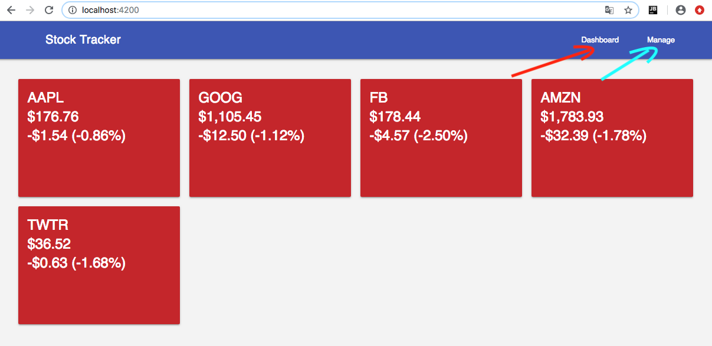

# Lier les pages grâce au nouveau routage

## Éditer le composant principal

   - ouvrir `app.component.html` afin d'y insérer la prise murale `<router-outlet>` permettant l'affichage des pages
   
```html
<main class="mdl-layout__content" stype="padding: 1.25rem;">
   <router-outlet></router-outlet>
</main>
```

   - dans `app.component.html` ajouter les différents de navigation `<nav>` liés `[routerLink]` au routage
   
```html
<nav class="mdl-navigation mdl-layout--large-screen-only">
   <a class="mdl-navigation__link" [routerLink]="['/']">Dashboard</a>
   <a class="mdl-navigation__link" [routerLink]="['/manage']">Manage</a>
</nav>
```

* Résultat Final

```html
<div class="mdl-layout mdl-js-layout mdl-layout--fixed-header">
  <header class="mdl-layout__header">
    <div class="mdl-layout__header-row">
      <span class="mdl-layout-title">Stock Tracker</span>
      <div class="mdl-layout-spacer"></div>
      <nav class="mdl-navigation mdl-layout--large-screen-only">
        <a class="mdl-navigation__link" [routerLink]="['/']">Dashboard</a>
        <a class="mdl-navigation__link" [routerLink]="['/manage']">Manage</a>
      </nav>
    </div>
  </header>
  <main class="mdl-layout__content" style="padding: 1.25rem;" >
    <router-outlet></router-outlet>
  </main>
</div>
```

## Naviguer à souhait


