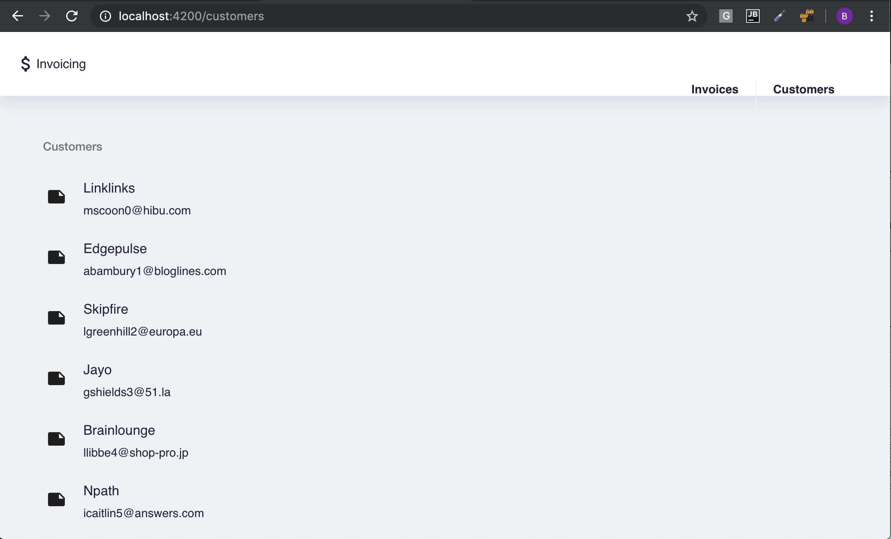

# Customers Path

The `Customers` components will be used to demonstrate the [`Template Driven`](https://angular.io/guide/forms) Forms 

###### Material Design

* Edit `app.module.ts` and add `MatButtonModule`, `MatListModule` and `MatIconModule` to the existing `MAT_MODULES` constant

```typescript
// Material Modules
const MAT_MODULES = [
  MatButtonModule,
  MatListModule,
  MatIconModule,
];
```


#### Master 

###### Generate `Customers` Component

```
$ ng generate component customers
```

###### Edit the `customers.component.ts`

* Add the local variable `customers` Array

```typescript
   customers: Customer[];
```

* Edit its `constructor` by addind the `CustomersService` class

```typescript
  constructor(private customersService: CustomersService) { }
```

* Edit its `ngOnInit` function with the below code

```typescript
  ngOnInit() {
    this.customersService.query<Array<Customer>>({sort: 'created', order: 'desc'})
      .subscribe(customers => {
        this.customers = customers;
      });
  }
```

* Final Result

```typescript
@Component({
  selector: 'app-customers',
  templateUrl: './customers.component.html',
  styleUrls: ['./customers.component.scss']
})
export class CustomersComponent implements OnInit {

  customers: Customer[];

  constructor(private customersService: CustomersService) { }

  ngOnInit() {
    this.customersService.query<Array<Customer>>({sort: 'created', order: 'desc'})
      .subscribe(customers => {
        this.customers = customers;
      });
  }
}
```

###### Edit the `customers.component.html`

* Replace all its content by the below snippet

```html
<mat-list *ngIf="customers">
  <h3 mat-subheader>Customers</h3>
  <mat-list-item *ngFor="let customer of customers" routerLink='/customers/{{customer.id}}'>
    <mat-icon mat-list-icon>note</mat-icon>
    <h4 mat-line>{{customer.name}}</h4>
    <p mat-line> {{customer.email}} </p>
  </mat-list-item>
</mat-list>
```


#### Routing

* Edit the `app.component.html` file and replace the `<router-outlet` tag with the `<app-customers>` tag

```html

    <!--The content below is only a placeholder and can be replaced.-->
    <app-customers></app-customers>
```

### You should see this



[:fast_forward: Next ](customer.md)
